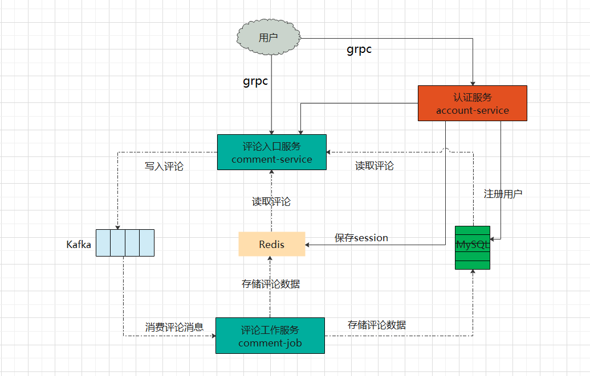

## 评论系统

### 需求

1. 用户通过页面发表评论
2. 作者和其它用户可以在用户所发表的评论下回复评论
3. 评论支持点赞功能
4. 包含用户的登录鉴权功能
5. 要支持海量并发的读和写评论

### 架构设计

1. 设计三个服务：认证服务、评论入口服务、评论工作服务
2. 写流程
   1. 评论入口服务收到用户写入的评论信息后存入消息队列Kafka
   2. 评论工作服务从Kafka接到评论消息后存入MySQL(或者Influxdb)
   3. 评论工作服务将消息存入MySQL后再向Redis存入一份
3. 读流程
   1. 评论入口服务收到用户的读请求后先在Redis中查找，如果有就返回给用户
   2. 如果Redis中没有要查找的的评论消息就从MySQL中读取，以返回给用户

### 功能

#### 认证服务

1. 登录
   1. 校验参数非空
   2. 根据用户名查询MySQL中是否存在该用户
   3. 如果存在且输入的密码正确则在Redis中存入用户id和token，并返回登录成功
   4. 如果用户不存在返回：该用户不存在错误
   5. 如果密码不正确则返回：密码不正确错误
2. 注册
   1. 校验参数非空
   2. 根据用户名查询数据库中是否已经存在该用户，如果已存在则返回：该用户已存在错误
   3. 如果不存在则存入MySQL中，并返回注册成功

#### 评论入口服务

1. 写评论

   1. 如果用户写入评论信息则向Kafka生产一条消息并返回保存成功

2. 展示评论

   

3. 评论点赞

   

#### 评论工作服务

1. 从Kafka消费评论消息
2. 向MySQL存消息
3. 向Redis存消息
4. 向Influxdb存消息
5. 向ElasticSearch存消息

### 开发步骤

1. 认证服务(account-service)
   - go工程化设计
   - wire依赖注入
   - grpc使用
   - go操作MySQL
   - 前后端实现交互
2. 评论入口服务(comment-service)
   - 用go语言向Kafka生产消息
   - go操作MySQL
   - go测试：Mock数据
3. 评论工作服务(comment-job)
   - 用go语言从Kafka消费消息
   - go语言操作MySQL
   - go语言操作Redis
   - go语言操作Influxdb
   - go语言操作ElasticSearch

### 所用技术

1. golang
2. wire
3. grpc
4. Kafka
5. MySQL
6. Redis
7. Influxdb
8. ElasticSearch